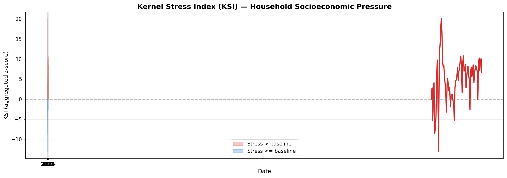

# Social State Quantification

*A New Framework for Real-Time Societal Observation Using Public Statistics*

> This repository provides the reference implementation and reproducible pipeline accompanying the preprint currently under submission to arXiv.

Author: **Tomo Nom (Independent Researcher)**

---



---

## Motivation

Existing socioeconomic indicators each capture only a fragment of societal conditions:

- **GDP** is published quarterly with significant lag — it cannot detect real-time pressure.
- **CPI** measures price levels only — it says nothing about wages, employment, or household capacity.
- **Unemployment rate** reflects labor market slack — but misses underemployment, overwork, and financial stress.

There is no single indicator that captures **household-level, multi-dimensional socioeconomic pressure** in real time. The Kernel Stress Index (KSI) fills this gap by integrating 10 public statistics into a unified state quantity, enabling continuous observation of societal stress as it accumulates.

---

## Overview

**Social State Quantification (SSQ)** is a new methodological framework for observing, measuring, and interpreting the real-time condition of a society using publicly available statistics.

This repository contains:

- The full research paper (PDF)
- Reference implementation of the **Kernel Stress Index (KSI)**
- Sample datasets and reproducible examples

The goal of this project is to establish a **transparent, reproducible, and extensible foundation** for a new academic discipline that integrates public statistics into unified state quantities.

---

## Key Concepts

### 1. Kernel Stress Index (KSI)

A unified state quantity that integrates heterogeneous public statistics into a single continuous indicator of household-level socioeconomic pressure.

**Algorithm:**
1. Convert each indicator into a z-score based on a 60-month moving window
2. Align indicator polarity toward the "stress-increasing" direction
3. Apply LOCF (Last Observation Carried Forward) to harmonize monthly data
4. Aggregate standardized indicators via vector summation

### 2. Social Stress Field

A spatial-temporal representation of societal tension derived from KSI.

### 3. Observation Device

A reproducible pipeline for transforming raw public statistics into interpretable state quantities.

---

## Repository Structure

```
social-state-quantification/
├── paper/          - Research paper (PDF)
├── src/            - Python implementation of KSI and related tools
│   ├── ksi.py      - Kernel Stress Index calculation
│   ├── utils.py    - Utility functions (z-score, LOCF, polarity)
│   └── examples/
│       └── demo.py - Usage example
├── data/           - Sample datasets
├── figures/        - Conceptual diagrams and results
├── LICENSE
├── README.md
└── requirements.txt
```

---

## Quick Start

```bash
git clone https://github.com/nom2025/social-state-quantification.git
cd social-state-quantification
pip install -r requirements.txt
python src/ksi.py --input data/sample_data.csv
```

---

## Paper

The full paper is available here:

- arXiv: [link will be added after publication]
- PDF is included in the `paper/` directory.

---

## Citation

If you use this framework in your research, please cite:

```
T. Nom, "Social State Quantification: A New Framework for Real-Time
Societal Observation Using Public Statistics", arXiv, 2026.
```

---

## License

MIT License. See [LICENSE](LICENSE) for details.
